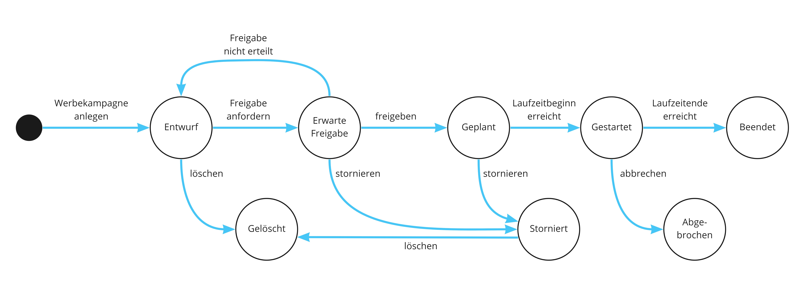

# NSBFunctionsDemo

An example of NServiceBus Serverless Approach using Azure Functions and Azure Service Bus (in German)

Uses [Stateless](https://github.com/dotnet-state-machine/stateless#stateless----) to represent the following lifecycle within NSB Sagas:

References:

[Azure Functions with Azure Service Bus](https://docs.particular.net/samples/azure-functions/service-bus/)

[Using NServiceBus in Azure Functions with Service Bus triggers](https://docs.particular.net/samples/azure-functions/service-bus)
